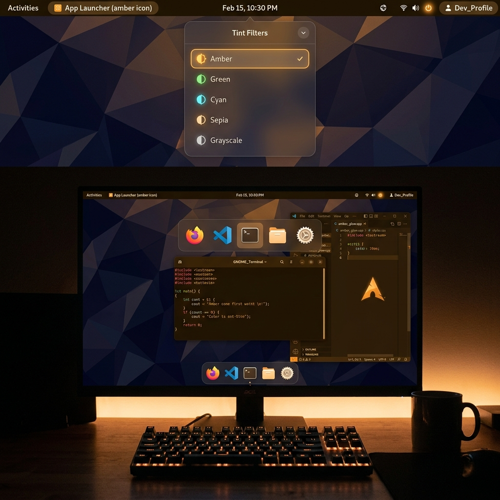

# Pasynkov Tint

> Modern, zero-overhead GNOME Shell extension for GPU-accelerated desktop color tinting and grayscale filters.



**UUID:** `pasynkov-tint@fedor-pasynkov.ru`  
**Compatibility:** GNOME Shell 42 – 46+ (Ubuntu 22.04 / 24.04+, Wayland & X11)  
**License:** MIT  

---

## 🌟 Overview

**Pasynkov Tint** is a high-performance color tinting extension for GNOME Shell. It provides customizable presets (Amber, Green, Cyan, Sepia, Grayscale) with smooth intensity adjustment, designed specifically to prevent screen flickering, framebuffer drops, and crashes when using Qt/Electron applications like Telegram Desktop.

Unlike traditional extensions that apply heavy stacked offscreen effects to `Main.uiGroup`, Pasynkov Tint uses a **per-actor single-pass GLSL shader architecture**.

---

## ✨ Key Features

- 🎨 **Color Presets:** Off, Amber (warm night), Green, Cyan, Sepia, and pure Grayscale (monochrome).
- ⚡ **Zero-Drop Engine:** Works seamlessly across Qt6/Electron apps (e.g. Telegram channels), Overview, and custom side docks (`right-dock`).
- 🎛️ **Mouse Wheel Intensity Control:** Scroll over the top bar icon to dynamically adjust tint strength (5% to 100%).
- 🖱️ **Instant Click Switching:** Left-click the top bar icon to cycle through presets or open the quick menu.
- 🖥️ **Desktop OSD Feedback:** Visual pop-up notification when changing presets or intensity (`Pasynkov Tint · Amber · 65%`).
- ⚠ **Emergency Reset:** Instant reset button directly in the popup menu to recover default state safely.
- 🌐 **Multi-language Support:** Complete English and Russian translations.
- ⚙️ **Libadwaita / GTK4 Preferences:** Built-in settings dialog compatible across GNOME 42 through 46+.

---

## 🏗️ Technical Architecture

Pasynkov Tint avoids the common `Failed to create offscreen effect framebuffer` bug in Mutter through three core design principles:

1. **Single-Pass GLSL Shader (`Shell.GLSLEffect`):** Combines desaturation, contrast/brightness, and RGB tinting into one unified shader pass, cutting GPU offscreen buffer allocations by 50%.
2. **Per-Actor Mapping:** Attaches shader instances to individual `MetaWindowActor` elements, `Main.panel`, `_backgroundGroup`, `_overview`, and tracked chrome actors (`right-dock`). Each GPU texture is bounded by actor size, preventing allocation failures on Wayland surface changes.
3. **GLSL Uniform Preprocessor Guard:** Uses `#ifndef PASYNKOV_TINT_UNIFORMS` to allow dozens of concurrent shader instances without shader link errors.

For full technical write-ups and bug resolution history, see:
- [`BUGS_AND_FIXES.md`](./BUGS_AND_FIXES.md) — Comprehensive bug journal & solutions
- [`BUG_OFFSCREEN_FRAMEBUFFER.md`](./BUG_OFFSCREEN_FRAMEBUFFER.md) — Offscreen framebuffer root cause analysis

---

## 🚀 Quick Installation

### Option 1: One-Liner (Recommended)

Run this single command in your terminal to install, compile schemas, and enable Pasynkov Tint instantly:

```bash
curl -fsSL https://raw.githubusercontent.com/your-username/pasynkov-tint/main/install.sh | bash
```

---

### Option 2: Manual Installation

1. **Clone the repository:**
   ```bash
   git clone https://github.com/your-username/pasynkov-tint.git
   cd pasynkov-tint
   ```

2. **Run installer script:**
   ```bash
   ./install.sh
   ```

*(On Wayland, restart GNOME Shell or log out/in to apply newly installed extensions if needed).*

---

## 🛠️ Management & Debugging Commands

- **Enable Extension:**
  ```bash
  gnome-extensions enable pasynkov-tint@fedor-pasynkov.ru
  ```

- **Disable Extension:**
  ```bash
  gnome-extensions disable pasynkov-tint@fedor-pasynkov.ru
  ```

- **Open Preferences Window:**
  ```bash
  gnome-extensions prefs pasynkov-tint@fedor-pasynkov.ru
  ```

- **View Live GNOME Shell Journal:**
  ```bash
  journalctl --user -f -o cat /usr/bin/gnome-shell | grep "Pasynkov Tint"
  ```

---

## 📄 License & Credits

- Developed by **Fedor Pasynkov**
- Released under the [MIT License](./LICENSE)
